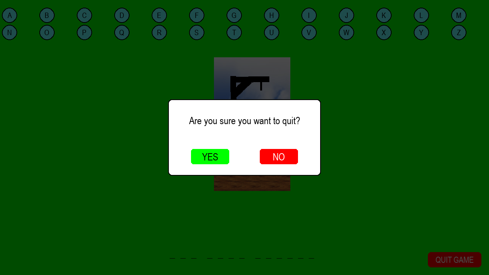

# Hangman Game in Python

A classic **Hangman game** built using **Python** and **Pygame**, featuring clickable letters, a quit confirmation popup, and the ability to take screenshots. This project is perfect for beginners learning Python and Pygame, or anyone who loves classic word games.

---

## 🎮 Features

- Clickable letter buttons to guess letters
- Visual hangman with 6 incorrect guesses
- Quit confirmation popup to prevent accidental exits
- Take screenshots of the game by pressing **`S`**
- Fullscreen support for an immersive experience
- Random word selection from `words.txt`

---

## 🖼 Screenshots

---

▶️ How to Play

1. Run the Hangman game:
   python hagman.py

2.Controls

Click letters on screen to guess.
Press S to take a screenshot (screenshots saved in screenshots/).
Press ESC to quit (confirmation popup appears).
The game pauses automatically if the window loses focus.

---

📦 Dependencies

Python 3.x

Pygame — install with:

pip install pygame

---

❗ Common Tips

Make sure the assets/ folder contains all hangman images (hangman0.jpg … hangman6.jpg) for correct rendering. 
If you rename files, update the file paths in the code accordingly.
---

Made with ❤️ using Python and Pygame
